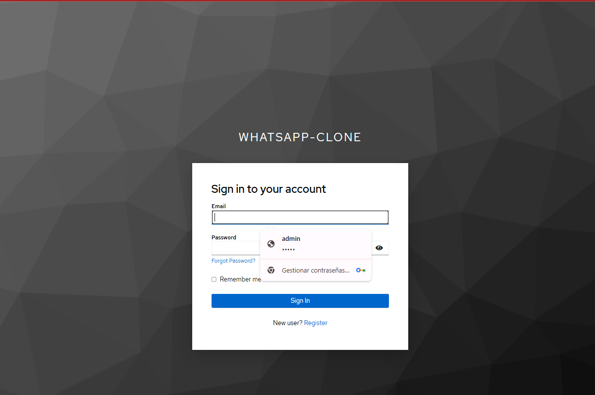
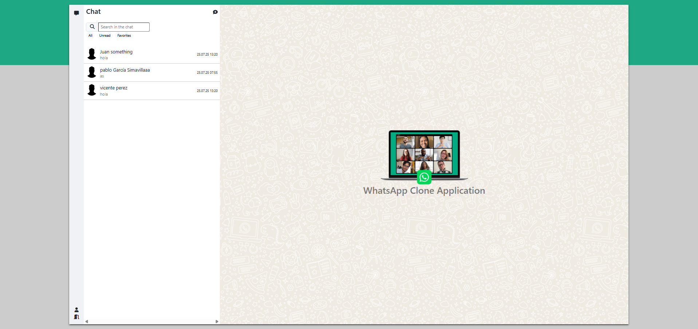
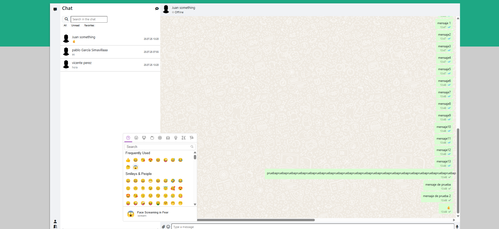
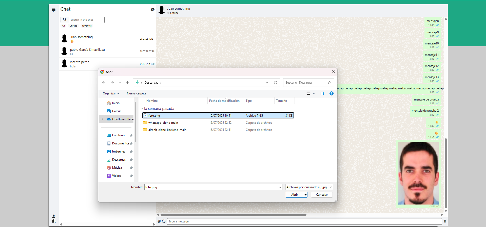
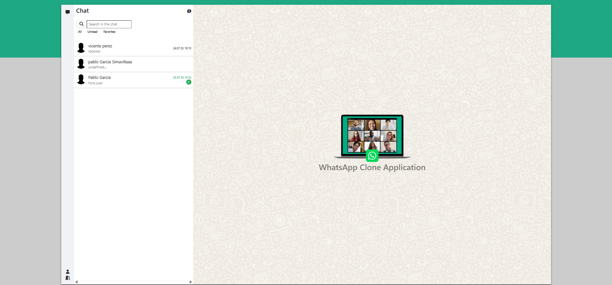

# WhatsApp Clone - Full Stack Application

This is a simple full-stack WhatsApp Clone application built with **Angular 19** (frontend) and **Spring Boot** (backend).

The application includes features such as real-time messaging, emoji support, and user authentication with Keycloak. WebSocket is used for live updates.

---

## Technologies Used

### 🔹 Frontend (Angular 19)
- `@angular/core` — Angular core framework
- `@angular/router` — Routing system
- `@ctrl/ngx-emoji-mart` — Emoji picker
- `@fortawesome/fontawesome-free` — FontAwesome icons
- `bootstrap` — CSS styling
- `keycloak-js` — Authentication with Keycloak
- `sockjs-client` + `stompjs` — WebSocket support for real-time messaging
- `ng-openapi-gen` — Auto-generates Angular services from OpenAPI spec

### 🔹 Backend (Spring Boot 3)
- `spring-boot-starter-data-jpa` — ORM with JPA and Hibernate
- `spring-boot-starter-web` — RESTful web services
- `spring-boot-starter-websocket` — Real-time messaging with WebSocket
- `spring-boot-starter-oauth2-resource-server` — Integration with Keycloak for authentication
- `spring-security-messaging` — Secures WebSocket communication
- `springdoc-openapi-starter-webmvc-ui` — Auto-generation of Swagger UI
- `postgresql` — PostgreSQL database driver
- `lombok` — Reduces boilerplate code for models (getters, setters, etc.)

---

### 🐳 Docker & Docker Compose
The project uses **Docker Compose** to simplify the setup of:

- PostgreSQL database
- Keycloak server (for authentication)
- Backend Spring Boot application

> This allows the whole stack to run locally with a single `docker-compose up`.

---

## Features
- ✅ Real-time 1:1 messaging via WebSocket
- ✅ Authentication access via Keycloak (OAuth2 Resource Server)
- ✅ Emoji support using EmojiMart
- ✅ Responsive layout with Bootstrap 5
- ✅ Swagger UI (via SpringDoc) for testing API endpoints

---

## Open API Documentation 📑

The API documentation for the application can be accessed via Swagger UI. The endpoints are available in the following environments:

- **Local Development**:  
  [Swagger UI Local](http://localhost:8080/swagger-ui/index.html#/)

---

## Interfaces 🖥️

### Login

### Main

### Emojis

### Attachments

### Notifications

